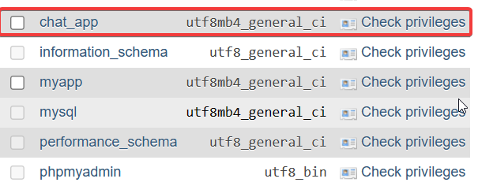

# Getting Started

## Download Project
1. Change into the project directory

   ```bash
   git clone https://github.com/hgbaodev/chat-app.git
   ```
   
2. Navigate to the project directory

   ```bash
   cd chat-app
   ```

## Start Client
### Requirement: Use Node.js v20.11.0
1. Change into the client directory

   ```bash
   cd client
   ```

2. Install npm dependencies

   ```bash
   npm install
   ```

3. Start the client interface

   ```bash
   npm run dev
   ```

## Start Server
### Step 1


1. Install Xampp
2. Create a database named "chat_app"

### Step 2 - For Windows
1. Install WSL2
2. Open WSL on Windows
3. Install redis-server

   - Step 1:

     ```bash
     sudo apt-add-repository ppa:redislabs/redis
     ```

   - Step 2:

     ```bash
     sudo apt-get update
     ```

   - Step 3:

     ```bash
     sudo apt-get upgrade
     ```

   - Step 4:

     ```bash
     sudo apt-get install redis-server
     ```

4. Run redis-server

   ```bash
   sudo service redis-server restart
   ```

### Step 3
1. Change into the project directory:

   ```bash
   cd server
   ```

2. Install pipenv:

   ```bash
   pip install pipenv
   ```

3. Activate the virtual environment

   ```bash
   pipenv shell
   ```

4. Update the database

   ```bash
   python manage.py migrate
   ```

5. Start the server

   ```bash
   python manage.py runserver
   ```
```

Copy and paste this content into a markdown file (e.g., `getting_started_instructions.md`). Make sure to adjust the Node.js version according to your project requirements - author hgbaodev.